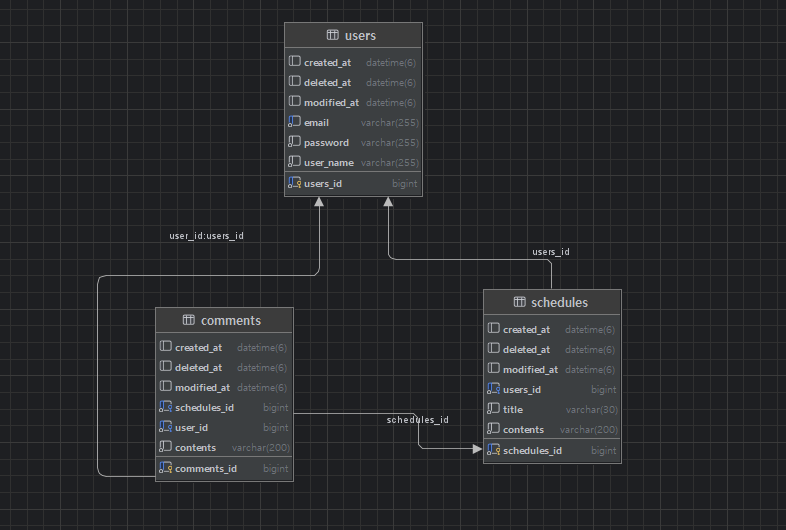

# Scheduler 프로젝트

Spring Boot 기반 일정 관리 서비스입니다.  
유저, 일정, 댓글에 대한 CRUD와 Session 기반 로그인/로그아웃을 제공합니다.

## 기술 스택
- Java 17
- Spring Boot 3.x
- Spring Web
- Spring Data JPA
- Validation
- MySQL
- Lombok

## API 명세서
하단 api 명세서 부분 참고

## 주요 기능

### 유저(User)
- 회원가입
- 로그인(세션)
- 로그아웃
- 유저 조회 / 수정 / 삭제

### 일정(Schedule)
- 일정 생성
- 전체 조회(페이징)
- 유저별 조회
- 일정 단일 조회
- 일정 수정 / 삭제
- 댓글 개수 포함 조회

### 댓글(Comment)
- 댓글 생성
- 일정별 조회(페이징)
- 댓글 단일 조회
- 댓글 수정 / 삭제

# Scheduler API 명세서

공통 Prefix: `/scheduler`  
응답 시간 필드: `createdAt`, `modifiedAt` 모두 `LocalDateTime`

---

## 1. User API

### 1-1. 회원가입

**POST /scheduler/signup**  
새 유저 생성

#### Request Body (SignupRequest)

| 필드명    | 타입    | 설명                             |
|----------|---------|----------------------------------|
| userName | String  | 유저명, 필수, 최대 10자          |
| email    | String  | 이메일, 필수, 이메일 형식        |
| password | String  | 비밀번호, 필수, 6~20자           |

예시  
{
"userName": "민상",
"email": "test@example.com",
"password": "123456"
}

#### Response 201 (SignupResponse)

| 필드명    | 타입           | 설명       |
|----------|----------------|------------|
| id       | Long           | 유저 ID    |
| userName | String         | 유저명     |
| email    | String         | 이메일     |
| createdAt   | String      | 생성 시각  |
| modifiedAt  | String      | 수정 시각  |

---

### 1-2. 로그인

**POST /scheduler/login**  
로그인 후 세션에 `loginUserId` 저장

#### Request Body (LoginRequest)

| 필드명   | 타입   | 설명                  |
|---------|--------|-----------------------|
| email   | String | 이메일, 필수, 이메일 형식 |
| password| String | 비밀번호, 필수        |

예시  
{
"email": "test@example.com",
"password": "123456"
}

#### Response 200

- Body 없음
- 세션: `loginUserId` 에 유저 ID 저장

---

### 1-3. 로그아웃

**POST /scheduler/logout**  
현재 로그인한 유저 로그아웃

- 세션에 `loginUserId` 없으면 `UserException(NOT_LOGGED_IN)` 발생

#### Response 204

- Body 없음
- 세션 invalidate

---

### 1-4. 전체 유저 조회

**GET /scheduler/users**

#### Query Params

| 이름     | 타입 | 기본값 | 설명       |
|---------|------|--------|------------|
| page    | int  | 0      | 페이지 번호 |
| pageSize| int  | 10     | 페이지 크기 |

#### Response 200

- Body: `Page<UserGetResponse>`

`UserGetResponse` 구조

| 필드명    | 타입           | 설명       |
|----------|----------------|------------|
| id       | Long           | 유저 ID    |
| userName | String         | 유저명     |
| email    | String         | 이메일     |
| createdAt| String         | 생성 시각  |
| modifiedAt| String        | 수정 시각  |

---

### 1-5. 유저 단일 조회

**GET /scheduler/users/{userId}**

#### Path Variable

| 이름   | 타입 | 설명   |
|--------|------|--------|
| userId | Long | 유저 ID |

#### Response 200

- Body: `UserGetResponse`

---

### 1-6. 유저 수정

**PUT /scheduler/users/{userId}**

#### Path Variable

| 이름   | 타입 | 설명   |
|--------|------|--------|
| userId | Long | 수정할 유저 ID |

#### Request Body (UserUpdateRequest)

| 필드명   | 타입   | 설명                    |
|---------|--------|-------------------------|
| userName| String | 변경할 유저명, 필수     |
| email   | String | 변경할 이메일, 필수, 이메일 형식 |

#### Response 200 (UserUpdateResponse)

- 필드 구조: `UserGetResponse` 와 동일

---

### 1-7. 유저 삭제

**DELETE /scheduler/users/{userId}**

#### Path Variable

| 이름   | 타입 | 설명    |
|--------|------|---------|
| userId | Long | 삭제 대상 유저 ID |

- 세션의 `loginUserId` 검사 후 삭제
- 삭제 후 세션 invalidate

#### Response 204

- Body 없음

---

## 2. Schedule API

### 2-1. 일정 생성

**POST /scheduler/schedules**

#### Request Body (ScheduleCreateRequest)

| 필드명  | 타입   | 설명             |
|--------|--------|------------------|
| title  | String | 제목, 필수       |
| contents | String | 내용, 필수     |

예시  
{
"title": "스터디",
"contents": "스프링 공부하기"
}

#### Response 201 (ScheduleCreateResponse)

| 필드명    | 타입           | 설명           |
|----------|----------------|----------------|
| id       | Long           | 일정 ID        |
| userName | String         | 작성자 이름     |
| title    | String         | 제목           |
| contents | String         | 내용           |
| createdAt| String         | 생성 시각      |
| modifiedAt| String        | 수정 시각      |

---

### 2-2. 전체 일정 조회

**GET /scheduler/schedules**

#### Query Params

| 이름     | 타입 | 기본값 | 설명       |
|---------|------|--------|------------|
| page    | int  | 0      | 페이지 번호 |
| pageSize| int  | 10     | 페이지 크기 |

#### Response 200

- Body: `Page<ScheduleGetResponse>`

`ScheduleGetResponse` 구조

| 필드명      | 타입           | 설명             |
|------------|----------------|------------------|
| id         | Long           | 일정 ID          |
| title      | String         | 제목             |
| userName   | String         | 작성자 이름       |
| contents   | String         | 내용             |
| commentCount | Long        | 댓글 개수        |
| createdAt  | String         | 생성 시각        |
| modifiedAt | String         | 수정 시각        |

---

### 2-3. 로그인 유저 일정 조회

**GET /scheduler/schedules/my**

- `@SessionAttribute("loginUserId")` 사용

#### Query Params

| 이름     | 타입 | 기본값 | 설명 |
|---------|------|--------|-------|
| page    | int  | 0      | 페이지 번호 |
| pageSize| int  | 10     | 페이지 크기 |

#### Response 200

- Body: `Page<ScheduleGetResponse>`

---

### 2-4. 특정 유저 일정 조회

**GET /scheduler/users/{userId}/schedules**

#### Path Variable

| 이름   | 타입 | 설명          |
|--------|------|---------------|
| userId | Long | 대상 유저 ID   |

#### Query Params 동일

#### Response 200

- Body: `Page<ScheduleGetResponse>`

---

### 2-5. 일정 단일 조회

**GET /scheduler/schedules/{scheduleId}**

#### Path Variable

| 이름       | 타입 | 설명     |
|------------|------|----------|
| scheduleId | Long | 일정 ID  |

#### Response 200

- Body: `ScheduleGetResponse`

---

### 2-6. 일정 수정

**PUT /scheduler/schedules/{scheduleId}**

#### Path Variable

| 이름       | 타입 | 설명         |
|------------|------|--------------|
| scheduleId | Long | 수정할 일정 ID |

#### Request Body (ScheduleUpdateRequest)

| 필드명  | 타입   | 설명         |
|--------|--------|--------------|
| title  | String | 수정 제목, 필수 |
| contents | String | 수정 내용, 필수 |

#### Response 200 (ScheduleUpdateResponse)

| 필드명    | 타입           | 설명           |
|----------|----------------|----------------|
| id       | Long           | 일정 ID        |
| title    | String         | 제목           |
| userName | String         | 작성자 이름     |
| contents | String         | 내용           |
| createdAt| String         | 생성 시각      |
| modifiedAt| String        | 수정 시각      |

---

### 2-7. 일정 삭제

**DELETE /scheduler/schedules/{scheduleId}**

#### Path Variable

| 이름       | 타입 | 설명        |
|------------|------|-------------|
| scheduleId | Long | 삭제할 일정 ID |

#### Response 204

- Body 없음

---

## 3. Comment API

### 3-1. 댓글 생성

**POST /scheduler/schedules/{scheduleId}/comments**

#### Path Variable

| 이름       | 타입 | 설명     |
|------------|------|----------|
| scheduleId | Long | 대상 일정 ID |

#### Request Body (CommentCreateRequest)

| 필드명   | 타입   | 설명         |
|---------|--------|--------------|
| contents| String | 댓글 내용, 필수 |

예시  
{
"contents": "댓글 내용입니다."
}

#### Response 201 (CommentCreateResponse)

| 필드명    | 타입           | 설명           |
|----------|----------------|----------------|
| id       | Long           | 댓글 ID        |
| userName | String         | 작성자 이름     |
| contents | String         | 내용           |
| createdAt| String         | 생성 시각      |
| modifiedAt| String        | 수정 시각      |

---

### 3-2. 일정별 댓글 조회

**GET /scheduler/schedules/{scheduleId}/comments**

#### Path Variable 동일

#### Query Params

| 이름     | 타입 | 기본값 | 설명       |
|---------|------|--------|------------|
| page    | int  | 0      | 페이지 번호 |
| pageSize| int  | 10     | 페이지 크기 |

#### Response 200

- Body: `Page<CommentGetResponse>`

---

### 3-3. 댓글 단일 조회

**GET /scheduler/schedules/{scheduleId}/comments/{commentId}**

#### Path Variable

| 이름       | 타입 | 설명     |
|------------|------|----------|
| scheduleId | Long | 일정 ID  |
| commentId  | Long | 댓글 ID  |

#### Response 200

- Body: `CommentGetResponse`

---

### 3-4. 댓글 수정

**PUT /scheduler/schedules/{scheduleId}/comments/{commentId}**

#### Path Variable 동일

#### Request Body (CommentUpdateRequest)

| 필드명   | 타입   | 설명             |
|---------|--------|------------------|
| contents| String | 수정할 내용, 필수 |

#### Response 200 (CommentUpdateResponse)

| 필드명    | 타입           | 설명           |
|----------|----------------|----------------|
| id       | Long           | 댓글 ID        |
| userName | String         | 작성자 이름     |
| contents | String         | 내용           |
| createdAt| String         | 생성 시각      |
| modifiedAt| String        | 수정 시각      |

---

### 3-5. 댓글 삭제

**DELETE /scheduler/schedules/{scheduleId}/comments/{commentId}**

#### Path Variable 동일

#### Response 204

- Body 없음

# ERD
